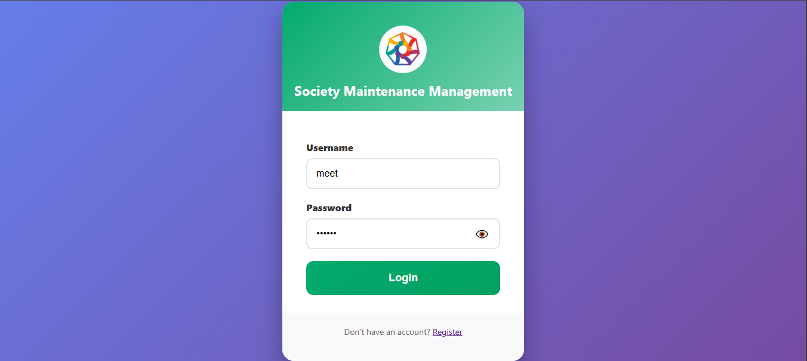
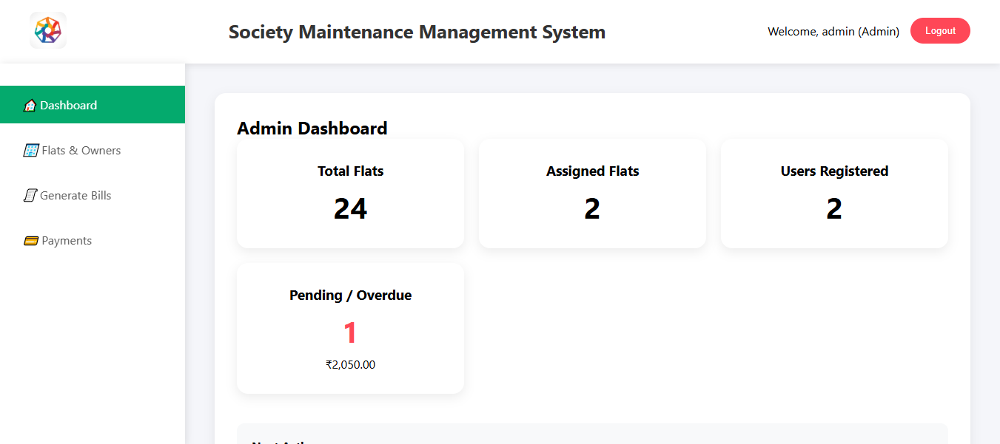
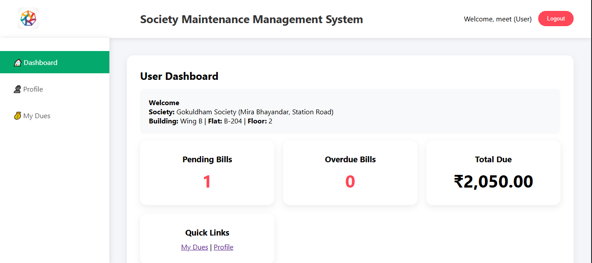
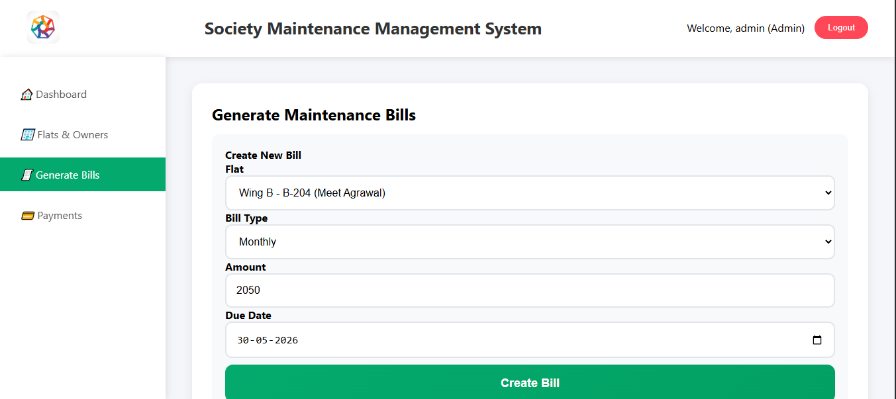
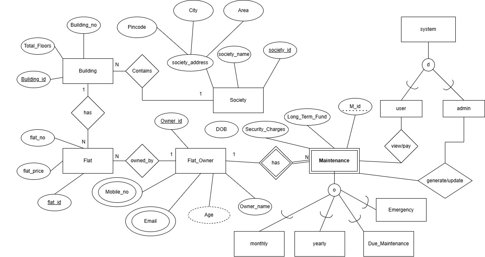

# 🏢 SocietyMS — Society Maintenance Management System

> A full-stack web application to digitize and streamline the management of residential societies — covering resident records, maintenance billing, payment tracking, flat management, and admin operations.

---

## 📸 Screenshots

> 

> 

> 

> 

---

## 📌 Table of Contents

- [Overview](#overview)
- [Problem Statement](#problem-statement)
- [Features](#features)
- [Tech Stack](#tech-stack)
- [Project Structure](#project-structure)
- [Database Schema](#database-schema)
- [Getting Started](#getting-started)
- [User Roles](#user-roles)
- [How to Use](#how-to-use)
- [Future Scope](#future-scope)
- [Team](#team)

---

## Overview

**SocietyMS** is a DBMS-backed web application designed to replace manual, paper-based processes in residential society management. It provides separate dashboards for **Admins** and **Residents**, enabling full lifecycle management of flats, bills, payments, and dues — all from a browser.

Built with **PHP**, **MySQL**, and **XAMPP** as the local server environment, the system implements secure session-based authentication, role-based access control, and a clean relational database schema.

---

## Problem Statement

Managing a residential society manually creates several recurring problems:

- Tracking monthly maintenance dues for dozens of flats is error-prone
- Residents have no visibility into their payment history or pending bills
- Admins spend hours reconciling payments and generating bills manually
- Complaints and notices have no central system

**SocietyMS solves this** by centralizing all society operations into one secure web application.

---

## Features

### Resident (User) Features
| Feature | Status |
|---|---|
| Register and login securely | ✅ |
| View personal dashboard | ✅ |
| View maintenance dues and bill history | ✅ |
| View profile and flat details | ✅ |
| Session-protected pages | ✅ |

### Admin Features
| Feature | Status |
|---|---|
| Admin dashboard with society overview | ✅ |
| Manage flats (add, view, assign residents) | ✅ |
| Generate and manage maintenance bills | ✅ |
| Track and record payments | ✅ |
| Initialize admin account via setup script | ✅ |
| Society setup and configuration | ✅ |

### Planned Features
| Feature | Status |
|---|---|
| Complaint / grievance module | 🔜 |
| Notice board for announcements | 🔜 |
| Expense tracking for society funds | 🔜 |
| Email/SMS payment reminders | 🔜 |
| PDF bill generation | 🔜 |

---

## Tech Stack

| Layer | Technology |
|---|---|
| Backend | PHP 8+ |
| Database | MySQL (via phpMyAdmin) |
| Frontend | HTML5, CSS3, JavaScript |
| Local Server | XAMPP (Apache + MySQL) |
| Session Management | PHP `$_SESSION` |
| Authentication | Password hashing (`password_hash` / `password_verify`) |

---

## Project Structure

```
SocietyMS/
│
├── index.php                  # Landing / entry point
├── login.php                  # Login form UI
├── login_process.php          # Login authentication logic
├── register.php               # Resident registration form
├── register_process.php       # Registration processing
├── logout.php                 # Session destroy & redirect
├── auth.php                   # Session guard (included on protected pages)
│
├── main.php                   # Main layout controller
├── layout.php                 # Shared HTML layout / navbar
├── ui_index.html              # Static UI prototype
│
├── user_dashboard.php         # Resident home dashboard
├── user_dues.php              # Resident dues and bill view
├── user_profile.php           # Resident profile page
│
├── admin_dashboard.php        # Admin home dashboard
├── admin_bills.php            # Admin: manage maintenance bills
├── admin_flats.php            # Admin: manage flats
├── admin_payments.php         # Admin: track payments
│
├── setup_society.php          # Initial society configuration
├── init_admin.php             # Admin account initialization
├── db.php                     # Database connection
├── database.sql               # Full database schema & seed data
│
├── style.css                  # Global stylesheet
├── script.js                  # Frontend JavaScript
└── logo.jpg                   # Society logo asset
```

---

## Database Schema

The system uses a MySQL relational database named `societyms`.

Key tables (from `database.sql`):

| Table | Purpose |
|---|---|
| `users` | Stores resident accounts (name, email, password hash, flat) |
| `admins` | Stores admin credentials |
| `flats` | Flat numbers, floors, and occupancy status |
| `bills` | Maintenance bills generated per flat per month |
| `payments` | Payment records linked to bills and residents |
| `society` | Society name, address, and configuration |

> 

---

## Getting Started

### Prerequisites

- [XAMPP](https://www.apachefriends.org/) (Apache + MySQL modules must be running)
- Any modern web browser
- [Git](https://git-scm.com/)

---

### Step 1 — Clone the Repository

Open a terminal and navigate to your XAMPP `htdocs` folder:

```bash
cd C:\xampp\htdocs\
```

Clone the project:

```bash
git clone https://github.com/meet0411/SocietyMS.git
```

---

### Step 2 — Create the Database

1. Open XAMPP Control Panel and start **Apache** and **MySQL**
2. Open your browser and go to:
   ```
   http://localhost/phpmyadmin
   ```
3. Click **New** → Enter database name: `societyms` → Click **Create**
4. Select the `societyms` database → Click the **SQL** tab
5. Open `database.sql` from the project folder, copy all the SQL code, paste it into the SQL tab, and click **Go**

---

### Step 3 — Initialize Admin Account

Visit the following URL once to create the default admin account:

```
http://localhost/SocietyMS/init_admin.php
```

> ⚠️ Delete or restrict `init_admin.php` after running it once for security.

---

### Step 4 — Configure Society (Optional)

Visit:
```
http://localhost/SocietyMS/setup_society.php
```
Enter your society name, address, and other settings.

---

### Step 5 — Run the Application

Open your browser and go to:
```
http://localhost/SocietyMS/
```

> ⚠️ Always run through XAMPP's Apache server. Opening `index.php` directly as a file will not work.

---

## User Roles

| Role | Access | Login URL |
|---|---|---|
| **Admin** | Full system access — manage flats, bills, payments, residents | `http://localhost/SocietyMS/login.php` |
| **Resident** | View own dashboard, dues, profile | `http://localhost/SocietyMS/login.php` |

---

## How to Use

### As a Resident

1. **Register** at `http://localhost/SocietyMS/register.php`
2. **Login** with your email and password
3. View your **Dashboard** for pending dues and bill history
4. Check **My Dues** for outstanding payments
5. **Logout** when done — session is securely destroyed

### As an Admin

1. **Login** with admin credentials (set via `init_admin.php`)
2. Use **Admin Dashboard** for a society-wide overview
3. Manage **Flats** — add new flats, assign residents
4. Generate **Bills** — create monthly maintenance bills per flat
5. Record **Payments** — mark bills as paid when residents pay

---

## Future Scope

- 📢 **Notice Board** — Post announcements visible to all residents
- 📝 **Complaint Module** — Residents submit complaints; admin resolves and closes them
- 💰 **Expense Tracking** — Record society expenditures against collected maintenance
- 📄 **PDF Bills** — Auto-generate downloadable PDF receipts per payment
- 📧 **Email Reminders** — Automated due date reminders via email/SMS
- 📱 **Mobile Responsive UI** — Fully responsive design for phone access
- 🔒 **Two-Factor Authentication** — Enhanced login security for admins

---

## Team

**Vidyavardhini's College of Engineering & Technology**
SE Computer Engineering (Second Year)

| Name | Role |
|---|---|
| Meet Agrawal | Developer |
| Pranav Bhatt | Developer |
| Ishan Chand | Developer |
| Varun Baliharia | Developer |

---

## 🔗 Repository

[https://github.com/meet0411/SocietyMS](https://github.com/meet0411/SocietyMS)

---

<p align="center">Built with ❤️ by Code Mafia &nbsp;|&nbsp; VCET, Mumbai</p>